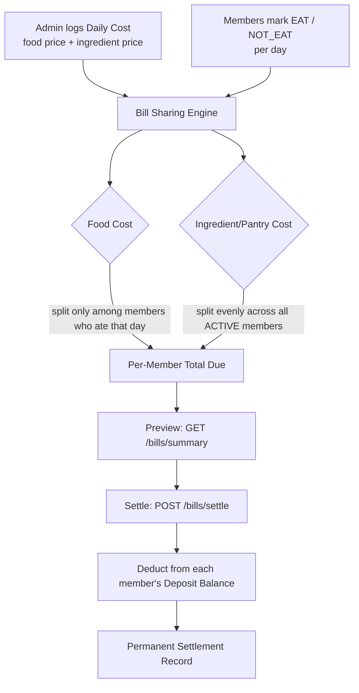
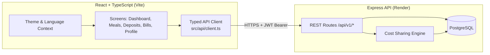

# 🍚 Household Food — Shared Meal & Cost Management

<div align="center">


**A real-time web dashboard for households and roommates to track shared meals, manage prepaid deposits, and settle food costs fairly — with a bilingual, light/dark, mobile-friendly UI.**

[🚀 Live App](#) · [📘 Live API Docs](https://household-food-system.onrender.com/swagger-ui/) · [🐛 Report an Issue](https://github.com/SARONCHAIRIN/household-food-system-web/issues)

</div>

---

## 📑 Table of Contents

- [Overview](#-overview)
- [Key Features](#-key-features)
- [Screens](#-screens)
- [How Cost Splitting Works](#-how-cost-splitting-works)
- [Tech Stack](#-tech-stack)
- [Architecture](#-architecture)
- [API Reference](#-api-reference)
- [Getting Started](#-getting-started)
- [Environment Variables](#-environment-variables)
- [Project Structure](#-project-structure)
- [Roles & Permissions](#-roles--permissions)
- [Internationalization](#-internationalization)
- [Roadmap](#-roadmap)
- [Contributing](#-contributing)

---

## 📖 Overview

Splitting food costs fairly in a shared household is normally a manual, error-prone chore — someone tracks a spreadsheet, someone forgets to log a grocery run, and disagreements follow.

**Household Food** replaces the spreadsheet with a real, live-data dashboard connected to a proper backend API:

- Members mark whether they're eating dinner each day.
- An admin logs the day's grocery and pantry spend.
- A **prepaid deposit wallet** lets members top up in advance, so settlement is a simple deduction rather than an IOU.
- At the end of a cycle, an admin previews the fair split, generates a per-member PDF report, and settles the bill — automatically deducting from each member's deposit balance.

Every number on screen is live — there is no mock or sample data anywhere in the app.

---

## ✨ Key Features

| | Feature | Description |
|---|---|---|
| 🔐 | **JWT Authentication** | Secure login/registration with role-based access (`ADMIN` / `MEMBER`). Public self-registration always creates a `MEMBER` account. |
| 🍳 | **Daily Meal Attendance** | Members mark `EAT` / `NOT_EAT` per day; a weekly date-strip and history view shows past attendance. |
| 🛒 | **Daily Cost Logging** | Admins record each day's food price and shared-ingredient price. |
| 💸 | **Fair Cost-Sharing Engine** | Food cost is split only among members who ate that day; ingredient/pantry cost is split evenly across all `ACTIVE` members — calculated entirely server-side. |
| 🏦 | **Prepaid Deposit Wallets** | Members hold a running balance; admins can credit deposits with a memo, and view full transaction history per member or across the whole household. |
| 🧾 | **Bill Settlement Engine** | One click previews dues for any date range, then settles — deducting from deposit balances and logging a permanent settlement record. Includes duplicate-settlement detection to prevent double-charging a period that was already settled. |
| 📄 | **PDF Settlement Reports** | Generate a pre-settlement preview report or a post-settlement receipt per member, ready to share or print. |
| 📊 | **Settlement History** | Every past settlement is retrievable, paginated, with settled-by, period, and totals. |
| 👥 | **Member Administration** | Admins can view all members and update status (`ACTIVE` / `INACTIVE` / `AWAY`). |
| 🌗 | **Light & Dark Theme** | Full Material 3-inspired color system for both modes, toggle persists across sessions. |
| 🌐 | **Bilingual UI (English / ខ្មែរ)** | Every screen, label, and status is fully localized — not just the shell. |
| 📚 | **Interactive API Docs** | Backend fully documented via Swagger UI. |

---

## 📱 Screens

| Screen | What it shows |
|---|---|
| **Dashboard** | Live food pool total, food-vs-pantry split, dinner attendance toggle, household member dues at a glance, recent daily costs. |
| **Meals** | Date-strip picker, today's EAT/SKIP decision, per-day pool cost, full attendance history with filters. |
| **Deposits** | Single-member balance inspector or all-members overview, credit-deposit form, full transaction ledger. |
| **Bills** | Date-range settlement preview, per-member due & wallet-coverage breakdown, PDF report generation, settle & deduct action, settlement history. |
| **Profile** | Account status, JWT session info, theme & language toggles, sign out. |

---

## 🔄 How Cost Splitting Works



1. Each day, an admin records the household's **food cost** and **ingredient cost**.
2. Each member marks themselves `EAT` or `NOT_EAT` for that day.
3. **Food cost** is divided only among the members who ate that specific day.
4. **Ingredient/pantry cost** is divided evenly across every currently `ACTIVE` member, regardless of daily attendance.
5. At settlement time, each member's total is deducted from their prepaid deposit balance — partial deduction is flagged if their balance is insufficient.
6. The settlement is permanently recorded and retrievable via history — a settled period cannot be silently re-charged without an explicit override warning.

---

## 🛠 Tech Stack

| Layer | Technology |
|---|---|
| Frontend framework | React 19 + TypeScript |
| Build tool | Vite 6 |
| Styling | Tailwind CSS 4, custom Material 3-style design tokens |
| Icons | Lucide React |
| Animation | Motion (Framer Motion) |
| Backend | Node.js + Express |
| Database | PostgreSQL |
| Schema | Prisma |
| Auth | JWT (access + refresh tokens), bcrypt password hashing |
| API Docs | Swagger UI (`swagger-jsdoc` + `swagger-ui-express`) |
| Hosting | Render (API), Google AI Studio / Cloud Run (web) |

---

## 🏗 Architecture



The frontend never computes cost splits or settlement math itself — every dollar figure shown is fetched directly from the API's already-calculated response, ensuring the UI and backend can never disagree on what a member owes.

---

## 📡 API Reference

Base URL: `https://household-food-system.onrender.com/api/v1` · Full docs: [`/swagger-ui`](https://household-food-system.onrender.com/swagger-ui/)

### 🔐 Auth
| Method | Endpoint | Description |
|---|---|---|
| `POST` | `/auth/register` | Register a new member (always `MEMBER` role via public UI) |
| `POST` | `/auth/login` | Log in, returns access + refresh tokens |

### 👥 Members & Users
| Method | Endpoint | Auth | Description |
|---|---|---|---|
| `GET` | `/members` | Public | List all household members |
| `PATCH` | `/users/:id/status` | Admin | Update a member's status (`ACTIVE`/`INACTIVE`/`AWAY`) |

### 🍽 Meals & Daily Costs
| Method | Endpoint | Auth | Description |
|---|---|---|---|
| `GET` | `/daily-costs` | Token | List recorded daily food/ingredient costs |
| `POST` | `/daily-costs` | Admin | Record a new day's cost |
| `GET` | `/meal-statuses` | Token | List meal attendance records |
| `POST` | `/meal-statuses` | Token | Set your own EAT/NOT_EAT status for a date |

### 🏦 Deposits
| Method | Endpoint | Auth | Description |
|---|---|---|---|
| `POST` | `/admin/deposits` | Admin | Credit a deposit to a member |
| `GET` | `/deposits/balance` | Token | Get a member's balance & transaction history |
| `GET` | `/admin/deposits/all` | Admin | Get every member's balance at once |

### 🧾 Bills & Settlement
| Method | Endpoint | Auth | Description |
|---|---|---|---|
| `GET` | `/bills/summary` | Admin | Preview cost-sharing totals for a date range (read-only) |
| `POST` | `/bills/settle` | Admin | Settle bills for a period & deduct from deposits |
| `GET` | `/bills/last-settlement` | Admin | Get the most recent settlement record |
| `GET` | `/bills/settlements` | Admin | Paginated settlement history |

All authenticated requests require `Authorization: Bearer <accessToken>`. All errors return `{ "error": "message" }`.

---

## 🚀 Getting Started

### Prerequisites
- Node.js ≥ 18
- npm

### Installation

```bash
# 1. Clone the repository
git clone https://github.com/SARONCHAIRIN/household-food-system-web.git
cd household-food-system-web

# 2. Install dependencies
npm install

# 3. Configure environment variables
cp .env.example .env   # then fill in the values (see below)

# 4. Start the dev server
npm run dev
```

The app will be available at `http://localhost:3000`.

```bash
npm run build     # production build
npm run preview   # preview the production build locally
npm run lint      # TypeScript type-checking
```

---

## 🔑 Environment Variables

| Variable | Required | Description |
|---|---|---|
| `VITE_API_URL` | ✅ | Backend API base URL, e.g. `https://household-food-system.onrender.com/api/v1` |
| `GEMINI_API_KEY` | ⬜ | Used for optional Gemini-powered features; injected automatically in AI Studio |
| `APP_URL` | ⬜ | Public URL of this app, used for self-referential links |

The in-app **API Server** switcher (Local / Cloud) lets you point the running app at a different backend at runtime without rebuilding, stored in `localStorage`.

---

## 📁 Project Structure

```text
household-food-system-web/
├── index.html
├── metadata.json
├── src/
│   ├── main.tsx
│   ├── App.tsx
│   ├── index.css                    # Design tokens (light + dark)
│   ├── types.ts                     # UI-facing view models
│   ├── api/
│   │   ├── client.ts                # Typed fetch wrapper + all endpoint calls
│   │   └── types.ts                 # API request/response contracts
│   ├── components/
│   │   ├── Header.tsx / BottomNav.tsx
│   │   ├── DashboardScreen.tsx
│   │   ├── MealsScreen.tsx
│   │   ├── DepositsScreen.tsx
│   │   ├── BillsScreen.tsx
│   │   ├── ProfileScreen.tsx
│   │   ├── AuthModal.tsx / ApiServerModal.tsx
│   │   ├── ManageMembersModal.tsx / ExportDataModal.tsx
│   │   └── Modals.tsx
│   ├── context/
│   │   ├── ThemeContext.tsx
│   │   └── LanguageContext.tsx
│   ├── locales/
│   │   └── translations.ts          # Full EN / KM string source of truth
│   └── utils/
│       └── csvExport.ts
└── ...
```

---

## 👥 Roles & Permissions

| Action | Member | Admin |
|---|:---:|:---:|
| Register / Login | ✅ | ✅ |
| View members list | ✅ | ✅ |
| Set own meal status | ✅ | ✅ |
| View own deposit balance | ✅ | ✅ |
| View daily costs / meal history | ✅ | ✅ |
| Record daily food/ingredient cost | ❌ | ✅ |
| Credit a member's deposit | ❌ | ✅ |
| View all members' deposit overview | ❌ | ✅ |
| Update a member's status | ❌ | ✅ |
| Preview & settle bills | ❌ | ✅ |
| View settlement history | ❌ | ✅ |

Role is read from the JWT issued at login — the UI hides admin-only navigation and actions entirely for `MEMBER` accounts rather than disabling them.

---

## 🌐 Internationalization

The entire UI — every label, button, empty state, and status badge — is available in **English** and **Khmer (ខ្មែរ)**, sourced from a single `translations.ts` file. Language and theme preferences persist across sessions and switch instantly without a page reload.

Real data (names, dates, dollar amounts) and raw backend error messages are never translated — only UI chrome and known/mapped status labels are localized.

---

## 🗺 Roadmap

- [ ] Backend enforcement to prevent re-settling an already-settled date range (server-side, not just a client warning)
- [ ] Per-day settlement status (`calculation_status`) properly excluded from future `/bills/summary` previews
- [ ] Email/notification on low deposit balance
- [ ] Meal voting & shared-shelf food logging
- [ ] Native cross-platform app (Flutter) sharing this same API
- [ ] Automated test coverage (unit + integration)

---

## 🤝 Contributing

Contributions and issue reports are welcome.

1. Fork the project
2. Create your feature branch (`git checkout -b feature/amazing-feature`)
3. Commit your changes (`git commit -m 'Add some amazing feature'`)
4. Push to the branch and open a Pull Request

---

<div align="center">
<sub>Built with ❤️ by <a href="https://github.com/SARONCHAIRIN">SARONCHAIRIN</a></sub>
</div>